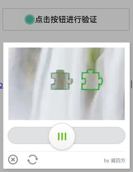

# TnCode 滑动验证码

弹出滑块滑动验证码，居于TnCode 并进行了一些改良

> 如需在`Laravel`中使用，请使用移步到 [GitHub](https://github.com/zhaoxianfang/tools)
> 
> `Laravel`中使用文档：[TnCode文档](https://weisifang.com/docs/doc/2_284)




## 快速上手

### 生成验证码图片

```php
require_once dirname(__FILE__) . '/TnCode.php';

$customConfig = [
    'slide_transparent_img' => dirname(__FILE__) . '/img/mark_01.png', // 自定义透明滑块图片
    'slide_dark_img'        => dirname(__FILE__) . '/img/mark_02.png', // 自定义黑色滑块图片
]

// 默认不需要传入配置
$tn = new TnCode();

// 如果需要自定义配置
$tn = new TnCode($customConfig);

// 生成图片
$tn->make();

// 如果需要自定义背景图片
$tn->make([
    'your/path/x.png',
    'your/path/xxx.png',
    'your/path/xxxx.png',
]);
```

### 验证结果

```php
require_once dirname(__FILE__) . '/TnCode.php';

$tn = new TnCode();
if ($tn->check()) {
    $_SESSION['tncode_check'] = 'ok';
    echo "ok"; // 验证通过
} else {
    $_SESSION['tncode_check'] = 'error';
    echo "error"; // 验证失败
}
die;
```
