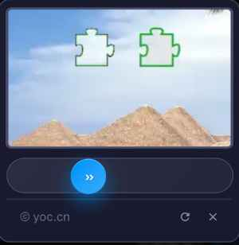

# xfCaptcha - 高性能滑动验证码 & 点击验证码 PHP 扩展包

[](https://php.net/)
[](LICENSE)

高性能、安全、易用的滑动验证码 & 点击验证码 PHP 扩展包，支持 Laravel、ThinkPHP 等主流 PHP 框架，也可在原生 PHP 中使用。

- **滑动验证码**：拖动拼图滑块完成验证
- **点击验证码**：按顺序点击图片中的文字/符号完成验证
- **双模式随机**：支持两种验证码随机展示，增强安全性



## ✨ 特性

- 🚀 **高性能**: 优化的图像处理算法，响应迅速
- 🔒 **高安全性**: 支持双重验证模式，容错机制、错误次数限制、防暴力破解、请求指纹绑定
- 🎨 **美观界面**: 现代化 UI 设计，支持浅色/深色主题
- 📱 **响应式**: 完美适配各种屏幕尺寸，移动端优化
- 🔧 **易集成**: 支持 Laravel 11+、ThinkPHP 8+ 等主流框架
- 🌍 **兼容性**: 支持 PHP 8.2+，不依赖任何第三方包
- ⚡ **轻量化**: 无外部依赖，安装即用
- 🛡️ **防重放**: Token 一次性使用，防止重放攻击
- 🔄 **易重置**: 提供 reset() 接口，表单失败后快速重置
- 🎯 **双模式**: 滑动验证码 + 点击验证码，支持随机切换
- 📝 **中文支持**: 点击验证码支持中文汉字和符号，自动检测系统字体

## 📋 环境要求

- PHP >= 8.2
- GD 扩展
- Laravel 11+ 或 ThinkPHP 8+（可选）

## 📦 安装

通过 Composer 安装：

```bash
composer require zxf/captcha
```

## 🚀 快速开始

### Laravel 中使用（支持 Laravel 11+）

#### 1. 安装服务提供者（Laravel 11+ 会自动发现）

**注意：本包需要 Laravel 11.0 或更高版本。**

对于需要手动注册的情况，在 `bootstrap/providers.php` 中注册服务提供者：

```php
return [
    // ...
    zxf\Captcha\Laravel\CaptchaServiceProvider::class,
];
```

#### 2. 发布配置文件

```bash
php artisan vendor:publish --tag=xf-captcha-config
```

#### 3. 在 Blade 模板中使用

Laravel 11 中引入 xfCaptcha 有三种方式：

**方式一：使用 Blade 组件（推荐）**

使用 `@include` 引入 Blade 组件，会自动在当前位置加载 CSS 和 JS 资源：

```blade
<!DOCTYPE html>
<html>
<head>
    <title>验证码演示</title>
</head>
<body>
    <form method="POST" action="/login" id="loginForm">
        @csrf

        <!-- 使用 Blade 组件 - 最简单的方式 -->
        @include('xf-captcha::captcha', [
            'selector' => '.xf-captcha',
            'placeholder' => '点击完成验证',
            'inputName' => 'xf_captcha',
            'width' => '100%',
            'height' => '40px',
            'borderRadius' => '4px',
            'onSuccess' => 'function(token) { console.log("验证成功", token); }',
            'onFail' => 'function() { console.log("验证失败"); }',
            'onClose' => 'function() { console.log("弹窗关闭"); }',
        ])

        <div class="xf-captcha"></div>

        <button type="submit">提交</button>
    </form>

    <script>
        // 表单提交示例
        document.getElementById('loginForm').addEventListener('submit', function(e) {
            e.preventDefault();

            fetch('/login', {
                method: 'POST',
                body: new FormData(this)
            })
            .then(response => response.json())
            .then(data => {
                if (data.success) {
                    alert('登录成功！');
                    window.location.href = '/dashboard';
                } else {
                    alert('登录失败：' + data.message);
                    // 重置验证码
                    xfCaptcha.reset();
                }
            });
        });
    </script>
</body>
</html>
```

> **注意**：Blade 组件会在 `@include` 的位置直接输出 `<link>` 和 `<script>` 标签。如果你需要将 JS 放在页面底部，请使用方式二手动引入资源。

**方式二：手动引入资源（需要自定义时）**

如果需要更多自定义控制（例如把 JS 放到页面底部），可以手动引入 CSS 和 JS：

```blade
<!DOCTYPE html>
<html>
<head>
    <title>验证码演示</title>
    <!-- 手动引入 CSS -->
    <link rel="stylesheet" href="{{ route('xf-captcha.css') }}">
</head>
<body>
    <form method="POST" action="/login" id="loginForm">
        @csrf

        <!-- 验证码容器 -->
        <div id="my-captcha"></div>

        <button type="submit">提交</button>
    </form>

    <!-- 在底部手动引入 JS -->
    <script src="{{ route('xf-captcha.js') }}"></script>
    <script>
        // 手动初始化
        xfCaptcha.init({
            handleDom: '#my-captcha',
            dataUrl: '{{ route('xf-captcha.data') }}',
            checkUrl: '{{ route('xf-captcha.check') }}',
            placeholder: '点击完成验证',
            inputName: 'xf_captcha',
            theme: 'auto'
        });

        // 表单提交
        document.getElementById('loginForm').addEventListener('submit', function(e) {
            e.preventDefault();

            fetch('/login', {
                method: 'POST',
                body: new FormData(this)
            })
            .then(response => response.json())
            .then(data => {
                if (data.success) {
                    alert('登录成功！');
                } else {
                    alert('登录失败：' + data.message);
                    xfCaptcha.reset();
                }
            });
        });
    </script>
</body>
</html>
```

**方式三：使用资源混合（Laravel Mix/Vite）**

如果使用 Laravel Mix 或 Vite 构建前端资源：

```javascript
// resources/js/app.js
import 'zxf/captcha/resources/assets/js/captcha';
import 'zxf/captcha/resources/assets/css/captcha.css';

// 初始化验证码
document.addEventListener('DOMContentLoaded', function() {
    xfCaptcha.init({
        handleDom: '.xf-captcha',
        dataUrl: '/xf_captcha/data',
        checkUrl: '/xf_captcha/check',
        inputName: 'xf_captcha'
    });
});
```

然后在 Blade 模板中：

```blade
<!DOCTYPE html>
<html>
<head>
    <title>验证码演示</title>
    @vite(['resources/css/app.css', 'resources/js/app.js'])
</head>
<body>
    <form method="POST" action="/login">
        @csrf
        <div class="xf-captcha"></div>
        <button type="submit">提交</button>
    </form>
</body>
</html>
```

#### Blade 组件参数说明

使用 `@include('xf-captcha::captcha', [...])` 时可以传入以下参数：

| 参数 | 类型 | 默认值 | 说明 |
|------|------|--------|------|
| `selector` | string | 自动生成 | 触发元素的选择器 |
| `placeholder` | string | `点击按钮进行验证` | 触发按钮的占位文字 |
| `slideText` | string | `拖动左边滑块完成上方拼图` | 滑动提示文字 |
| `clickText` | string | `请按照顺序点击图片中的文字` | 点击提示文字 |
| `successText` | string | `✓ 验证成功` | 验证成功提示 |
| `failText` | string | `验证失败，请重试` | 验证失败提示 |
| `inputName` | string | `xf_captcha_token` | 隐藏输入框的 `name` 属性 |
| `autoInsertInput` | bool | `true` | 验证成功后是否自动插入隐藏输入框 |
| `theme` | string | `auto` | 主题：`light`、`dark`、`auto` |
| `showClose` | bool | `true` | 是否显示关闭按钮 |
| `showRefresh` | bool | `true` | 是否显示刷新按钮 |
| `showRipple` | bool | `true` | 是否显示水波纹效果 |
| `width` | string | — | 自定义触发按钮宽度（如 `100%`、`260px`） |
| `height` | string | — | 自定义触发按钮高度（如 `40px`） |
| `borderRadius` | string | — | 自定义触发按钮圆角（如 `4px`） |
| `onSuccess` | string | — | 验证成功回调函数字符串，如 `function(token) { ... }` |
| `onFail` | string | — | 验证失败回调函数字符串 |
| `onClose` | string | — | 弹窗关闭回调函数字符串 |
| `attributes` | string | — | 额外的 HTML 属性字符串 |

#### 4. 后端验证

```php
use Illuminate\Http\Request;

public function login(Request $request)
{
    // 验证请求
    $validated = $request->validate([
        'email' => 'required|email',
        'password' => 'required',
        'xf_captcha' => 'required|xfCaptcha', // 验证验证码
    ], [
        'xf_captcha.required' => '请完成验证',
        'xf_captcha.xf_captcha' => '验证失败，请重新验证',
    ]);
    
    // 登录逻辑...
}
```

### ThinkPHP 中使用（支持 ThinkPHP 8+）

#### 1. 配置

在 `config/service.php` 中添加：

```php
return [
    // ...
    'services' => [
        zxf\Captcha\ThinkPHP\CaptchaService::class,
    ],
];
```

#### 2. 发布配置

```bash
php think vendor:publish zxf/captcha
```

#### 3. 在模板中使用

```html
<!DOCTYPE html>
<html>
<head>
    <title>验证码演示</title>
    <link rel="stylesheet" href="/xf_captcha/css">
</head>
<body>
    <form method="POST" action="/login" id="loginForm">
        <div class="xf-captcha"></div>
        <input type="hidden" name="xf_captcha_token" id="xf_captcha_token">
        <button type="submit">提交</button>
    </form>
    
    <script src="/xf_captcha/js"></script>
    <script>
        xfCaptcha.init({
            handleDom: '.xf-captcha',
            dataUrl: '/xf_captcha/data',
            checkUrl: '/xf_captcha/check',
            inputName: 'xf_captcha_token'
        });
        
        // 表单提交
        document.getElementById('loginForm').addEventListener('submit', function(e) {
            e.preventDefault();
            
            fetch('/login', {
                method: 'POST',
                body: new FormData(this)
            })
            .then(response => response.json())
            .then(data => {
                if (data.code === 200) {
                    alert('登录成功！');
                } else {
                    alert('登录失败：' + data.msg);
                    xfCaptcha.reset(); // 重置验证码
                }
            });
        });
    </script>
</body>
</html>
```

#### 4. 后端验证

```php
use zxf\Captcha\Captcha;

public function login()
{
    $data = input('post.');
    
    // 验证验证码
    $captcha = app('xfCaptcha');
    $result = $captcha->verify(null, $data['xf_captcha_token'] ?? '');
    
    if (!$result['success']) {
        return json(['code' => 400, 'msg' => $result['message']]);
    }
    
    // 登录逻辑...
}
```

### 原生 PHP 中使用

```php
<?php
require_once 'vendor/autoload.php';

use zxf\Captcha\Captcha;

session_start();

// 创建验证码实例
$captcha = new Captcha([
    'verify_mode' => Captcha::VERIFY_DUAL, // 双重验证模式
]);

// 获取验证码数据（支持滑动和点击验证码）
if ($_GET['action'] === 'data') {
    $isRefresh = isset($_GET['refresh']) || isset($_GET['_s']);
    $result = $captcha->makeData([], $isRefresh);
    header('Content-Type: application/json');
    echo json_encode([
        'success' => true,
        'code' => 200,
        'type' => $result['type'],
        'image_base64' => $result['image_base64'],
        'hint' => $result['hint'],
        'bg_width' => $result['bg_width'],
        'bg_height' => $result['bg_height'],
        'mark_width' => $result['mark_width'] ?? null,
        'mark_height' => $result['mark_height'] ?? null,
        'char_count' => $result['char_count'] ?? null,
    ]);
    exit;
}

// 生成验证码图片（向后兼容）
if ($_GET['action'] === 'image') {
    $captcha->make();
    exit;
}

// 验证
if ($_GET['action'] === 'check') {
    $clickPoints = $_GET['click_points'] ?? $_POST['click_points'] ?? [];
    if (is_string($clickPoints)) {
        $clickPoints = json_decode($clickPoints, true) ?: [];
    }
    $result = $captcha->verify($_GET['captcha_r'] ?? null, $_GET['xf_captcha_token'] ?? null, $clickPoints);
    header('Content-Type: application/json');
    echo json_encode($result);
    exit;
}
?>
<!DOCTYPE html>
<html>
<head>
    <title>验证码演示</title>
    <link rel="stylesheet" href="/path/to/captcha.css">
</head>
<body>
    <form method="POST" action="/submit" id="myForm">
        <div class="xf-captcha"></div>
        <input type="hidden" name="xf_captcha_token" id="xf_captcha_token">
        <button type="submit">提交</button>
    </form>
    
    <script src="/path/to/captcha.js"></script>
    <script>
        xfCaptcha.init({
            handleDom: '.xf-captcha',
            dataUrl: '?action=data',
            checkUrl: '?action=check',
            inputName: 'xf_captcha_token'
        });
        
        // 表单提交
        document.getElementById('myForm').addEventListener('submit', function(e) {
            e.preventDefault();
            
            fetch('/submit', {
                method: 'POST',
                body: new FormData(this)
            })
            .then(response => response.json())
            .then(data => {
                if (data.success) {
                    alert('提交成功！');
                } else {
                    alert('提交失败：' + data.message);
                    xfCaptcha.reset(); // 重置验证码
                }
            });
        });
    </script>
</body>
</html>
```

## ⚙️ 配置说明

### 完整配置示例

```php
<?php
return [
    /*
    |--------------------------------------------------------------------------
    | 验证码类型
    |--------------------------------------------------------------------------
    |
    | - 'slide' : 滑动验证码（传统拼图滑块）
    | - 'click' : 点击验证码（按顺序点击图片中的文字/符号）
    | - 'both'  : 两者同时使用并随机展示（推荐）
    |
    */
    'captcha_type' => 'both',

    /*
    |--------------------------------------------------------------------------
    | 滑块图片路径
    |--------------------------------------------------------------------------
    |
    | 自定义滑块图片，留空则使用默认图片
    |
    */
    'slide_dark_img' => '',
    'slide_transparent_img' => '',
    
    /*
    |--------------------------------------------------------------------------
    | 背景图片配置
    |--------------------------------------------------------------------------
    |
    | 可以配置背景图片目录或具体图片路径数组
    |
    */
    'bg_images_dir' => '',
    'bg_images' => [],
    
    /*
    |--------------------------------------------------------------------------
    | 容错像素值
    |--------------------------------------------------------------------------
    |
    | 滑动位置允许的误差范围（像素）
    |
    */
    'fault_tolerance' => 3,
    
    /*
    |--------------------------------------------------------------------------
    | 最大错误次数
    |--------------------------------------------------------------------------
    |
    | 超过此次数后需要刷新验证码
    |
    */
    'max_error_count' => 10,
    
    /*
    |--------------------------------------------------------------------------
    | 图片尺寸
    |--------------------------------------------------------------------------
    */
    'bg_width' => 240,
    'bg_height' => 150,
    'mark_width' => 50,
    'mark_height' => 50,
    
    /*
    |--------------------------------------------------------------------------
    | 输出格式
    |--------------------------------------------------------------------------
    */
    'output_format' => 'webp', // 'webp' 或 'png'
    'webp_quality' => 40,
    'png_quality' => 7,
    
    /*
    |--------------------------------------------------------------------------
    | Session 前缀
    |--------------------------------------------------------------------------
    */
    'session_prefix' => 'xf_captcha',
    
    /*
    |--------------------------------------------------------------------------
    | 资源路由配置
    |--------------------------------------------------------------------------
    */
    'route_prefix' => 'xf_captcha',
    
    /*
    |--------------------------------------------------------------------------
    | 验证模式
    |--------------------------------------------------------------------------
    |
    | frontend_only - 仅前端验证（不安全，仅测试）
    | backend_only  - 仅后端验证
    | dual          - 双重验证（推荐，最安全）
    |
    */
    'verify_mode' => 'dual',
    
    /*
    |--------------------------------------------------------------------------
    | Token 过期时间（秒）
    |--------------------------------------------------------------------------
    */
    'token_expire' => 300,

    /*
    |--------------------------------------------------------------------------
    | 点击验证码配置
    |--------------------------------------------------------------------------
    |
    */
    'click' => [
        // 点击验证的文字数量（推荐 3-5 个）
        'char_count' => 4,

        // 点击容错范围（像素，推荐 20-30）
        'fault_tolerance' => 25,

        // 字符库（留空则使用默认中文+符号混合库）
        'chars' => [],

        // 中文字体路径（自动检测常见系统字体，也可手动指定）
        'font_path' => '',

        // 文字大小（推荐 24-32，确保清晰可见）
        'font_size' => 26,

        // 文字颜色 [R, G, B]（留空则随机高对比度颜色）
        'font_color' => [],

        // 是否添加文字阴影/描边增强可读性
        'text_stroke' => true,

        // 是否添加文字背景半透明遮罩增强可读性
        'text_bg_overlay' => true,

        // 提示文字模板（%s 会被替换为需要点击的字符）
        'hint_text' => '请依次点击：%s',

        // 是否启用文字随机旋转（增强安全性）
        'text_rotate' => true,

        // 最大旋转角度（度数）
        'max_rotate' => 30,
    ],
    
    /*
    |--------------------------------------------------------------------------
    | 前端配置
    |--------------------------------------------------------------------------
    */
    'frontend' => [
        'theme' => 'auto', // 'light' | 'dark' | 'auto'
        'input_name' => 'xf_captcha_token',
        'auto_insert_input' => true,
        'placeholder' => '点击按钮进行验证',
        'slide_text' => '拖动左边滑块完成上方拼图',
        'click_text' => '请按照顺序点击图片中的文字',
        'success_text' => '✓ 验证成功',
        'fail_text' => '验证失败，请重试',
        'show_close' => true,
        'show_refresh' => true,
        'show_ripple' => true,
    ],
];
```

### 验证模式说明

#### 1. frontend_only - 仅前端验证（不安全）

仅在前端进行滑动验证，不发送请求到后端。此模式仅用于测试，**不推荐在生产环境使用**。

#### 2. backend_only - 仅后端验证

传统的验证模式，用户滑动后前端发送位置到后端验证。验证通过后返回成功状态，并立即销毁 session 数据。

#### 3. dual - 双重验证（推荐）

最安全的验证模式，流程如下：

**滑动验证码流程**：
1. **首次验证**：用户滑动滑块，前端发送位置到后端
2. **生成 Token**：后端验证位置正确后，生成一次性 Token 返回
3. **存储 Token**：前端将 Token 存入隐藏输入框
4. **二次验证**：表单提交时，后端验证 Token 有效性
5. **销毁 Token**：Token 一次性使用，验证后立即销毁

**点击验证码流程**：
1. **首次验证**：用户按顺序点击图片中的文字/符号，前端发送点击坐标到后端
2. **生成 Token**：后端验证点击顺序和位置正确后，生成一次性 Token 返回
3. **存储 Token**：前端将 Token 存入隐藏输入框
4. **二次验证**：表单提交时，后端验证 Token 有效性
5. **销毁 Token**：Token 一次性使用，验证后立即销毁

**安全特性**：
- Token 一次性使用，防止重放攻击
- Token 有过期时间（默认5分钟）
- 验证码本身有过期时间（默认10分钟）
- 请求指纹绑定（User-Agent + IP + 语言），防止 Session 劫持
- 使用 hash_equals 防止时序攻击
- 首次验证后 session 数据保留，二次验证后销毁

## 🔌 JavaScript API

### 初始化

```javascript
xfCaptcha.init({
    handleDom: '.xf-captcha',       // 触发元素选择器
    dataUrl: '/xf_captcha/data',    // 数据接口地址（获取验证码类型和图片）
    imageUrl: '/xf_captcha/image',  // 图片接口地址（向后兼容）
    checkUrl: '/xf_captcha/check',  // 验证接口地址
    placeholder: '点击按钮进行验证', // 按钮占位文字
    slideText: '拖动左边滑块完成上方拼图', // 滑动提示
    clickText: '请按照顺序点击图片中的文字', // 点击提示
    successText: '✓ 验证成功',      // 成功提示
    failText: '验证失败，请重试',    // 失败提示
    showClose: true,                // 显示关闭按钮
    showRefresh: true,              // 显示刷新按钮
    showRipple: true,               // 显示水波纹效果
    theme: 'auto',                  // 主题: 'light' | 'dark' | 'auto'
    inputName: 'xf_captcha_token',  // 隐藏输入框 name
    autoInsertInput: true,          // 自动插入隐藏输入框
});
```

### 方法

```javascript
// 获取验证结果
const isVerified = xfCaptcha.result();

// 获取验证令牌（双重验证模式）
const token = xfCaptcha.getToken();

// 动态切换主题
xfCaptcha.setTheme('dark');

// 刷新验证码
xfCaptcha.refresh();

// 显示/隐藏验证码弹窗
xfCaptcha.show();
xfCaptcha.hide();

// 重置验证码状态（表单提交失败后使用）
xfCaptcha.reset();
```

### 事件回调

```javascript
xfCaptcha.init({
    // ... 配置
})
.onSuccess(function(token) {
    console.log('验证成功，Token:', token);
    // 可以在这里添加自定义逻辑
})
.onFail(function() {
    console.log('验证失败');
    // 验证失败后的处理
})
.onClose(function() {
    console.log('验证码弹窗关闭');
    // 弹窗关闭后的处理
});
```

### 表单提交示例

```javascript
document.getElementById('myForm').addEventListener('submit', function(e) {
    e.preventDefault();
    
    // 检查是否已完成验证
    if (!xfCaptcha.result()) {
        alert('请先完成验证');
        return;
    }
    
    fetch('/submit', {
        method: 'POST',
        body: new FormData(this)
    })
    .then(response => response.json())
    .then(data => {
        if (data.success) {
            alert('提交成功！');
            // 重置表单
            this.reset();
            // 重置验证码
            xfCaptcha.reset();
        } else {
            alert('提交失败：' + data.message);
            // 表单提交失败，重置验证码
            xfCaptcha.reset();
        }
    })
    .catch(error => {
        console.error('Error:', error);
        alert('网络错误，请重试');
        xfCaptcha.reset();
    });
});
```

## 🛡️ 安全建议

1. **使用双重验证模式**：生产环境请务必使用 `dual` 验证模式
2. **启用 HTTPS**：防止 Token 被中间人窃取
3. **限制错误次数**：合理设置 `max_error_count` 防止暴力破解
4. **自定义背景图**：使用自己的背景图片，增加识别难度
5. **调整容错值**：根据安全需求调整 `fault_tolerance`
6. **及时重置**：表单提交失败后及时调用 `xfCaptcha.reset()`
7. **Token 过期时间**：根据业务需求调整 `token_expire`
8. **请求指纹绑定**：系统会自动绑定 User-Agent、IP 和语言指纹，防止 Session 劫持
9. **验证码过期机制**：验证码生成后超过 10 分钟未验证将自动失效，需重新获取

## 🔧 常见问题

### Q: 验证码图片不显示？

A: 请检查：
1. GD 扩展是否安装：`php -m | grep gd`
2. 背景图片目录是否存在且可读
3. 路由配置是否正确
4. 浏览器控制台是否有错误信息

### Q: 验证总是失败？

A: 请检查：
1. Session 是否正常启动
2. 容错值是否设置过小（建议 3-5 像素）
3. 浏览器是否支持 WebP（可强制使用 PNG）
4. 服务器时间是否准确（影响 Token 过期判断）

### Q: 移动端滑动卡顿？

A: 已针对移动端优化，如仍有问题请检查：
1. 是否有其他 JavaScript 冲突
2. 页面是否有大量重绘
3. 是否使用了 `touch-action: none` 样式

### Q: Token 验证失败？

A: 请检查：
1. Token 是否在有效期内（默认5分钟）
2. Token 是否已被使用过
3. Session 是否正常
4. 前端是否正确保存了 Token

### Q: 如何自定义样式？

A: 可以通过覆盖 CSS 变量来自定义样式：

```css
:root {
    --xf-captcha-bg: #ffffff;
    --xf-captcha-text: #303133;
    --xf-captcha-border: #dcdfe6;
    --xf-captcha-msg-error-bg: #ff4d4f;
    --xf-captcha-msg-ok-bg: #52c41a;
}
```

### Q: 如何禁用关闭和刷新按钮？

A: 在初始化时设置：

```javascript
xfCaptcha.init({
    showClose: false,
    showRefresh: false,
});
```

## 📄 许可证

MIT License

## 👨‍💻 作者

zhaoxianfang <zhaoxianfang@163.com>

## 📝 更新日志

### v2.2.0
- **新增点击验证码**：支持按顺序点击图片中的文字/符号完成验证
- **双模式支持**：支持滑动验证码、点击验证码以及随机切换模式（`slide`/`click`/`both`）
- **安全增强**：新增请求指纹绑定（User-Agent + IP + 语言），防止 Session 劫持
- **安全增强**：新增验证码过期机制（默认 10 分钟），防止长期重放攻击
- **配置增强**：点击验证码支持完整的自定义配置（字符库、字体、颜色、旋转、遮罩等）
- **UI 优化**：点击验证码文字字号加大、标记改为半透明、移除进度提示、隐藏滑动组件
- **交互优化**：点击验证码光标改为 pointer，点击容错范围扩大，元素样式过渡更平滑
- **字符库**：默认使用中文汉字 + 符号混合库，自动检测系统字体路径
- **框架兼容**：ThinkPHP 补齐 `/data` 数据接口，与 Laravel 功能保持一致
- **文档完善**：补充点击验证码使用说明、安全特性描述和完整配置示例

### v2.1.0
- **安全修复**：修复 Blade 组件回调解析问题，避免组件失效
- **安全修复**：修复 Laravel/ThinkPHP 验证器扩展漏洞，双重验证模式下空 token 不再绕过二次验证
- **安全修复**：修复前端重新打开弹窗时旧 token 未被清理的问题，关闭后再次验证不会再被服务端误判为成功
- **安全修复**：首次验证请求由 GET 改为 POST，避免 `captcha_r` 暴露在 URL 中
- **功能增强**：Blade 组件新增 `width`、`height`、`borderRadius` 参数支持
- **功能增强**：JS API 补齐 `getToken()` 和 `setTheme()` 方法
- **体验优化**：验证成功自动关闭弹窗的定时器现在可被正确取消，避免干扰新一轮验证
- **体验优化**：验证失败时同步清理前端 token 和隐藏输入框
- **体验优化**：图片加载失败提示更加友好
- **文档完善**：补充 Blade 组件完整参数说明表和各种资源引入方式

### v2.0.0
- 重构验证逻辑，支持三种验证模式
- 新增双重验证模式，提高安全性
- 优化移动端兼容性
- 支持主题切换（浅色/深色/自动）
- 新增 `reset()` 接口
- 移除中间件配置
- 修复已知问题

### v1.0.0
- 初始版本发布
- 支持 Laravel 和 ThinkPHP
- 基础滑动验证功能
